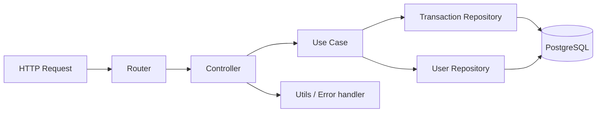
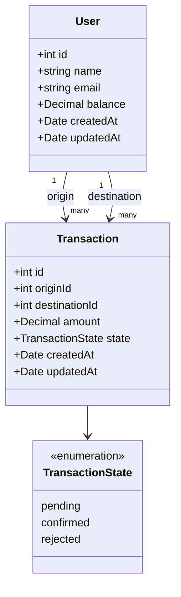

# API Fintech

Mini plataforma fintech para enrutar y validar pagos internos entre usuarios con Node.js, Express, Prisma y PostgreSQL.

## 1. Arquitectura del repo

### Estructura de carpetas

```text
src/
  app.ts
  database/
    prisma.ts
  users/
    entities.ts
    repository.ts
  transactions/
    controller.ts
    errors.ts
    entities.ts
    repository.ts
    routers.ts
    use-cases.ts
    utils.ts
    use-cases.test.ts
    utils.test.ts
  generated/
    prisma/
prisma/
  schema.prisma
```

### Capas implementadas

- `routers`: define endpoints y monta el controller.
- `controller`: recibe `Request/Response`, parsea entrada y arma respuestas HTTP.
- `use-cases`: concentra reglas de negocio.
- `repository`: encapsula acceso a datos y transacciones Prisma.
- `utils`: helpers reutilizables para parsing, serialización y manejo de errores.
- `errors`: errores de aplicación con `statusCode`.

### Flujo de ejecución



### UML de entidades



## 2. Levantar la aplicación con Docker Compose

Requisitos:
- Docker
- Docker Compose

Comando:

```bash
docker compose up --build
```

Servicios:
- API: `http://localhost:3000`
- PostgreSQL: `localhost:5432`

Healthcheck:

```bash
curl http://localhost:3000/healthcheck
```

Respuesta esperada:

```json
{"status":"ok"}
```

## 3. Probar los endpoints

### `POST /transactions`

```bash
curl -i -X POST http://localhost:3000/transactions \
  -H "Content-Type: application/json" \
  -d '{"originId":1,"destinationId":2,"amount":1000}'
```

### `GET /transactions?userId=1`

```bash
curl -i "http://localhost:3000/transactions?userId=1"
```

### `PATCH /transactions/:id/approve`

```bash
curl -i -X PATCH http://localhost:3000/transactions/1/approve
```

### `PATCH /transactions/:id/reject`

```bash
curl -i -X PATCH http://localhost:3000/transactions/1/reject
```

Notas:
- `amount` se envía como número JSON.
- Las transacciones mayores a `50000` quedan `pending` si el origen tiene saldo suficiente.
- Para probar manualmente, conviene tener usuarios creados en la base.

## 4. Correr los tests

Comando:

```bash
npm test
```

Qué cubren:
- `src/transactions/use-cases.test.ts`: reglas de negocio con mocks de repositorios.
- `src/transactions/utils.test.ts`: parsing, serialización y manejo de errores.

Validación extra:

```bash
npx tsc --noEmit --target ES2022 --module NodeNext --moduleResolution NodeNext --strict --esModuleInterop --skipLibCheck src/app.ts
```

